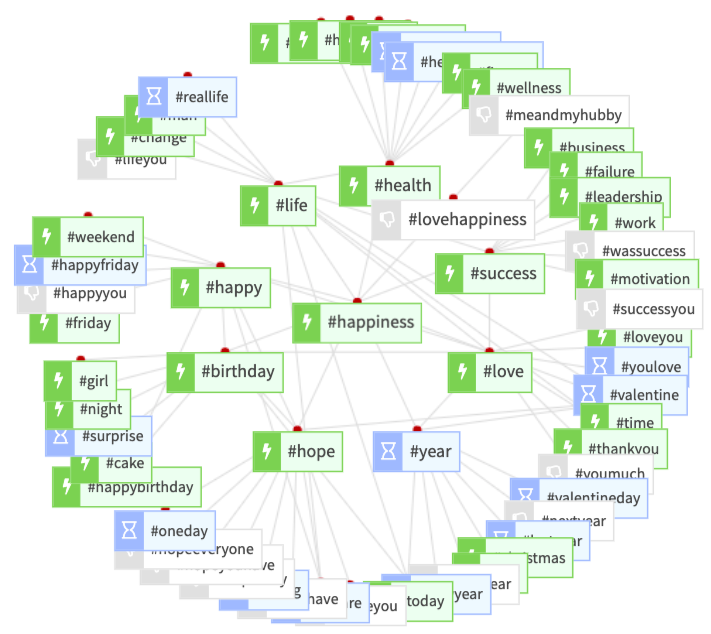
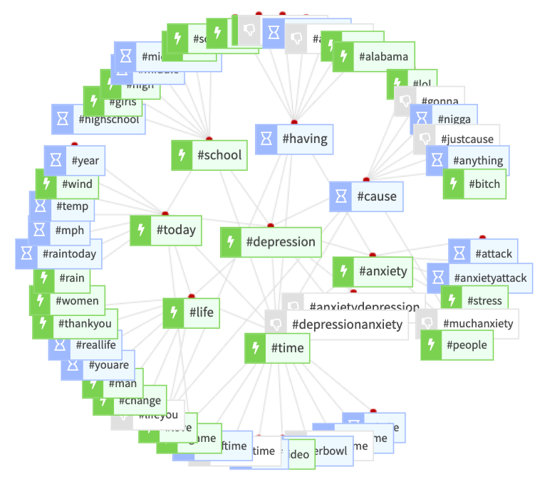
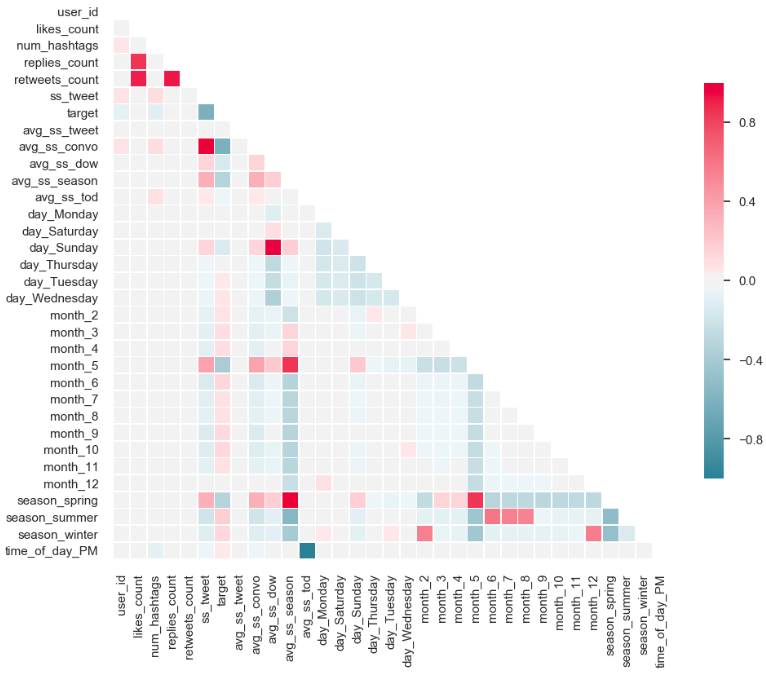
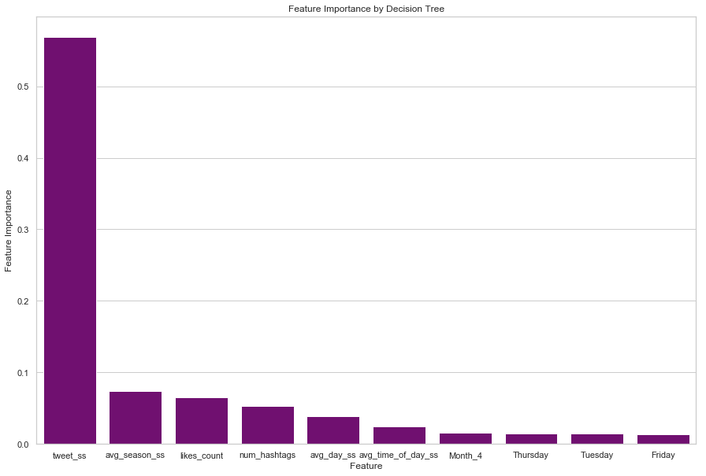
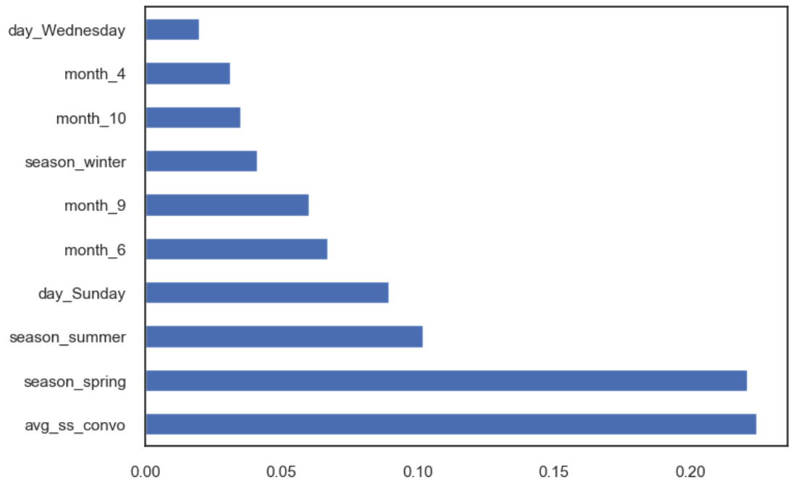
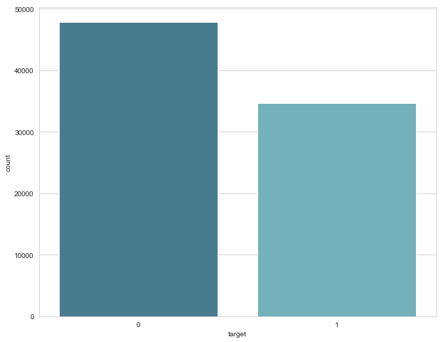
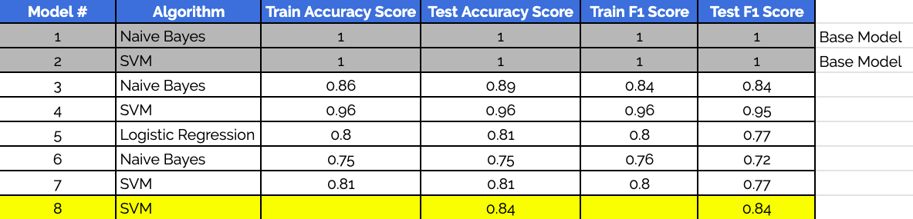
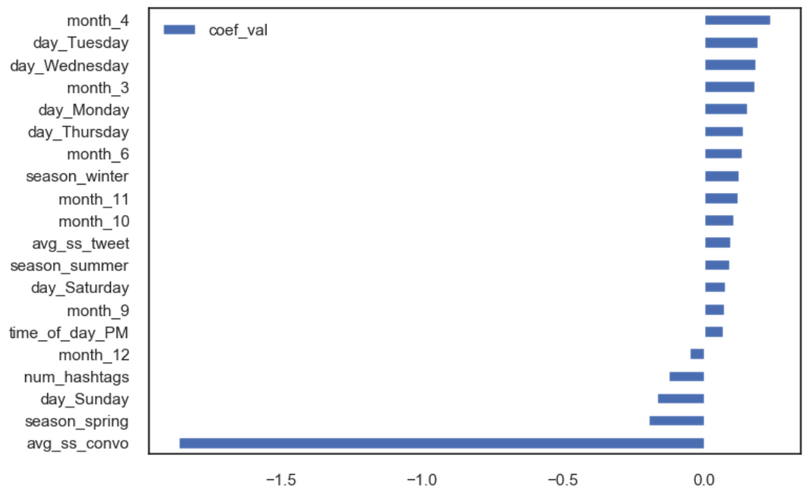
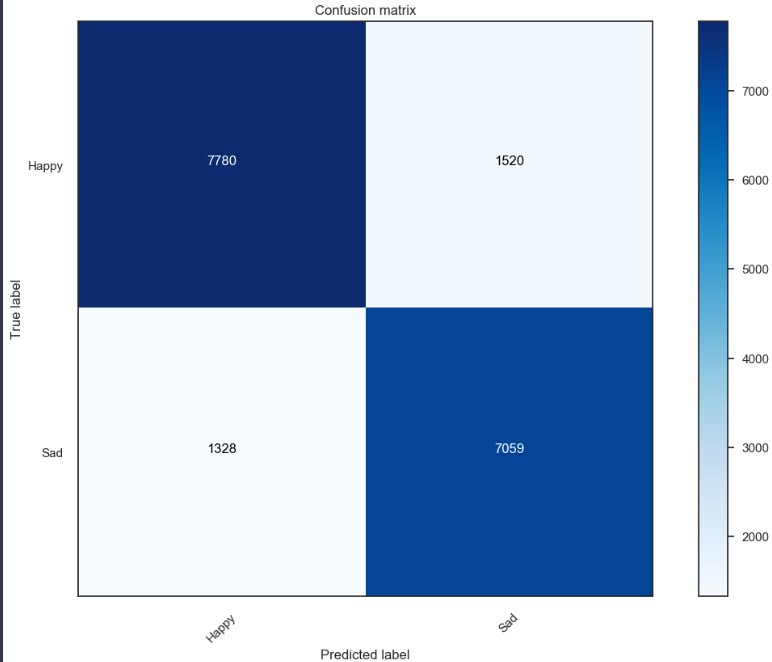

# Inferring Overall User Mood With Twitter Sentiment Analysis

## Project Overview

According to the <a src='https://www.nimh.nih.gov/health/topics/depression/index.shtml'>National Institute of Mental Health</a>, depression is one of the most common mental disorders in the U.S., caused by a mix of genetic, environmental, and psychological factors. This disorder can occur at any age and symptoms, which can be disruptive, vary per individual. Fortunately, it can be treated regardless of severity, but treatment is more effective when it is diagnosed at an earlier stage.

For this project, we were interested in answering the question: is it possible to infer if a user is at risk for depression from social media activity. With the emergence of the internet where individuals spend most of their time online, there is a wealth of data that can be tapped for analysis to better understand the user's overall mood. However, we were unable to obtain medical data, which would be important to tackling this particular question. Therefore, we decided to approach it from another perspective.

The problem evaluated in this project was: can we predict the user's overall mood based on certain features from tweets? Our thinking was that if a user is on the happier side of the spectrum, s/he is less at risk for depression than if a user is on the sadder side of the spectrum. We approached the question as a binary classification problem with our target variable as the user's overall mood (0 = happy, 1 = sad). The data used were 1-year of tweets from May 28th 2018 to May 28th 2019, scraped from Twitter using TWINT, a Python advanced scraping tool for Twitter. We scraped tweets based on specific keywords and hashtags, based on their relationships to the words happiness and depression as showed by the word network map on <a src='http://www.ritetag.com'>Ritetag.com</a>. 

      

About a half million tweets were able to be obtained, and after processing, the final dataset consisted of about 103,000 tweets. Each tweet was given a compound sentiment score using the Valence Aware Dictionary for Sentiment Reasoning (VADER), which is a model sensitive to the polarity (positive/negative) and intensity (strength) of emotion used in text sentiment analysis especially tailored for social media evaluation. Using the sentiment score for each tweet, we engineered additional variables which looked at the interactions between different features. After data processing and feature engineering, including creating dummy variables for all categorical variables, all tweets were aggregated to the user-level, with each value representing an average. After our base models, all highly correlated features (|correlation| > 0.7) were removed. The feature importance results from using the Extra Trees Classifier in Recursive Feature Elimination showed that the top 20 features were: average sentiment score of conversation, average sentiment score of each tweet user posted, and the average number of tweets user posted depending of time of day, week, month, and season. According to feature elimination, the optimal number of features for the model was 20. Our final model after Randomized Search was a Support Vector Machine model with 20 features and parameters: C = 1.1979, kernel = 'rbf', and gamma = 0.0858. The accuracy score of the model on testing data was 0.84. The confusion matrix showed that the model was pretty accurate in predicting both True Postives (predict user is sad when user is actually sad) and True Negatives (predict user is happy when user is happy).

## Target Variable Labelling Methodology

Some assumptions were made during this project:
- A tweet was labeled as ‘sad’ if the search word or hashtag used to obtain the tweet was a negative term and vice versa.
- If a user posted a ‘depressed’ tweet before, this overrode prior tweets that were ‘happy’.

## Disclaimer

Because this is sensitive topic and assumptions made, we would like to note that we are not making amy medical claims or diagnoses about a user with these results. In addition, because we are not medical professionals and since we are unable to obtain real medical data for comparison with the results of this project, we do not recommend using this for actual medical practice or medical advice. This project is only for educational purposes.

## Data Preprocessing

- All columns with null values were dropped.
- Only columns that remained as possible features for modelling were kept.
- Some data types were downcasted to reduce memory footprint.
- Two major dataframes were created during this project:
    - Original dataframe: Tweet-level data
    - Main dataframe (after processing): User-level data (for modelling and predictions)

## Natural Language Processing

VADER is 'a lexicon and rule-based sentiment analysis tool that is specifically attuned to sentiments expressed in social media.' As a module specifically created to evaluate the sentiments in social media, it was the prefect NLP tool to use in this project. More information on VADER can be found on their website <a src='https://github.com/cjhutto/vaderSentiment'>here</a>.

During the data preprocessing step in the previous section, we did not remove any punctuation, remove any emojis, lowercase any words, or tokenize words, which usually occurs for NLP, because they would adversely affect the sentiment scores given by VADER. In order to better evaluate the intensity of emotion and polarity of the language used in the tweets, punctuation, case of the words, and emojis are important. Using the Sentiment Intensity Analyzer in VADER, each tweet was given a sentiment score between -1 (most negative) and 1 (most positive).

## Feature Engineering

New features were created at the tweet-level and later aggregated as averages at the user-level. All categorical features were changed to dummy variables at the tweet-level before aggregation. The features engineered were:

- Target Variable (0 = happy, 1 = sad)
- Number of Hashtags: number of hashtags used in each tweet
- Time of Day: when hashtag was posted (AM, PM)
- Day of Week: the day of the week when tweet was posted
- Season: based on month tweet was posted
- Sentiment score: sentiment score of each tweet using Vader

## Feature Importance & Selection

We reviewed the correlation between pairs of features for feature selection. The highly correlated features removed (|correlation| > 0.7) were:

- Average Count of Replies Per Tweet User Posts
- Average Count of Retweets Per Tweet User Posts
- Average Sentiment Score Per Conversation
- Average Sentime Score Based on Tag (Search Keyword or Hashtag)
- Search Keyword = Depression
- Search Keyword = Happy
- Average Number of Tweets User Posts on a Sunday
- Average Number of Tweets User Posts in Spring
- Average Number of Tweets User Posts in the Afternoon/Night

    

In addition, we used multiple feature importance tools to assist with feature elimination for modelling. These are the two major results:

<b>Feature Importance Using Decision Tree Classifier</b>

<u>Top 5 Important Features</u>

- Average User Tweet Sentiment Score
- Average Sentiment Score Per Season
- Average Count of Likes Per Tweet Posted
- Average Number of Hashtags Used Per Tweet
- Average Sentiment Score of Tweet Posted Based on Day of Week
- Average Sentiment Score of Tweet Posted Based on Time of Day

    

<b>Feature Importance Using Extra Trees Classifer through Recursive Feature Elimination</b>

This was ulimately used for the final model as it was noted through feature elimination that 20 is the optimal number of features.

    

<u>Top 20 Important Features</u>

- Average Number of Hashtags Used Per Tweet
- Average Sentiment Score Per Tweet
- Average Sentiment Score Per Conversation
- Average Number of Tweets Posted on Monday
- Average Number of Tweets Posted on Saturday
- Average Number of Tweets Posted on Sunday
- Average Number of Tweets Posted on Thursday
- Average Number of Tweets Posted on Tuesday
- Average Number of Tweets Posted on Wednesday
- Average Number of Tweets Posted in March
- Average Number of Tweets Posted in April
- Average Number of Tweets Posted in June
- Average Number of Tweets Posted in September
- Average Number of Tweets Posted in October
- Average Number of Tweets Posted in November
- Average Number of Tweets Posted in December
- Average Number of Tweets Posted in Spring
- Average Number of Tweets Posted in Summer
- Average Number of Tweets Posted in Winter
- Average Number of Tweets Posted in the Afternoon/Night (PM)

    

## Class Imbalance

Class imbalance was fixed using downsampling, which resamples the majority class to create a smaller subset of the class to match the number of samples in the minority class.

## Models

Our initial base models (Models 1 & 2 in the below chart), without removing any features, showed an accuracy score and F1 score of 1. After removing the highly correlated features, we still obtain models with accuracy scores of mid-0.80s to 1 (Models 3 & 4 in the below chart). As we looked further into the important features, we realized that one of the features should have been removed as it was used in the creation of the target variable. Although not shown in the correlation evaluation, there is multicolinearity. After removing the 'tag' feature, which is the feature indicating what search word or hashtag was used to obtain the tweet, and after randomized search, we settled on our final model. It was a Support Vector Machine model with an accuracy score and F1 score of 0.84. 

A breakdown of the feature weights for the final model are shown below:

The confusion matrix for the final model showed that it was fairly accurate in predicting True Positives (predict user is sad if actually sad) and True Negatives (predict user is happy if actually happy).

## Conclusion & Possible Applications

This topic is worth further exploration. If we are able to use Twitter or other social media platforms to identify those who are at-risk for depression earlier, we can provide any necessary resources sooner for more effective treatment. However, there are some caveats. Some thoughts to keep in mind are that there may be ethical implications with employers pre-screening prospective candidates, privacy concerns regarding using social media data for diagnosis, and possible misidentification due to the error rate.

## Recommended Next Steps

- Run more models to find better models for prediction
- Additional data cleaning can be done in consideration of data integrity and to possibly use other analysis methods to find other relationships in the data
- Obtain medical data (if possible) to check the accuracy of the model and validate our assumptions